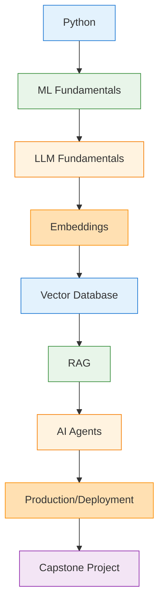
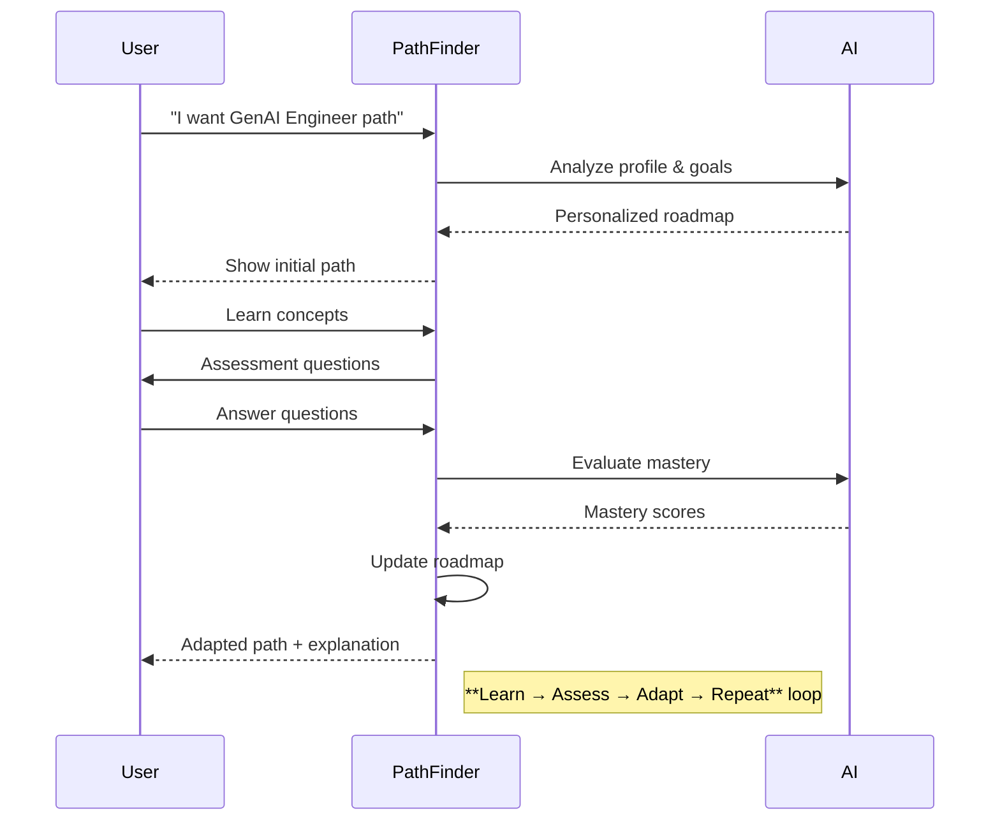

# 🧠 PathFinder Project Overview

## 🔥 What Makes PathFinder Different

### 1. Starts from the learner, not from a fixed course list
- Asks: "What do YOU already know, what is YOUR goal, how much time do YOU have, and when do YOU want to reach it?"
- Builds the path from that information

### 2. Identifies the actual skill gap
- Current skills → Target career requirements → Prerequisites → **YOUR SKILL GAP**
- Example: Python ✓, ML ✓, LLM ❌, Embeddings ❌, Vector DB ❌, RAG ❌

### 3. Understands prerequisites
- Won't randomly say: RAG → Python → Embeddings
- Understands proper sequence: **LLM → Embeddings → Vector DB → RAG → Agents**

### 4. The biggest uniqueness: the roadmap changes
- **Most systems:** Generate roadmap → User follows it → Done
- **PathFinder:** Generate roadmap → Learn → Assessment → Measure mastery → Update roadmap → Learn → Assessment → Update again → ...

### 5. AI is not making the entire roadmap blindly
- **AI:** Understands user, explains recommendations, provides tutoring
- **System:** Skill gaps, prerequisites, ranking, learning sequence, mastery, adaptation

### 6. It explains WHY
- User can ask: "Why am I learning Vector DB?"
- AI explains the decision using the learner's actual state
- Makes the system transparent instead of giving unexplained recommendations

---

## 🎯 Core Uniqueness (3 Words)

### **Personalized → Prerequisite-aware → Adaptive**

### 🏆 Strongest Phrase
> **"PathFinder doesn't just create a learning path. It continuously recalculates the learning path based on demonstrated mastery."**

---

## 📋 Project Hierarchy

| Priority | Category | Description |
|----------|----------|-------------|
| 🔥 **Must work** | Skill Gap → Recommendation → Path → Assessment → Adaptation | Core adaptive loop |
| 👍 **Should work** | AI onboarding → AI explanations → AI tutor | AI-enhanced experience |
| 💡 **Nice to have** | RAG → dynamic resources → advanced analytics → more careers | Future extensions |

---

## ⚠️ Weaknesses

| # | Weakness | Current V1 | Impact |
|---|----------|------------|--------|
| 1 | **Limited real-world data** | **77 canonical skills**, 70 career-skill rows (5 careers fully mapped), 65 prerequisites, JSON assessments | Recommendations limited to provided knowledge |
| 2 | **Rule-based personalization** | Explicit scoring system | Not an ML model learning from thousands |
| 3 | **Single demo learner** | No authentication/multi-user | Prototype-only limitation |
| 4 | **Static resources** | Curated only, no dynamic discovery | Quality depends on catalog freshness |
| 5 | **Small assessments** | 10 questions per assessment | Could get lucky on several questions |
| 6 | **Not deeply learned** | Adapts to current learner only | No population-level learning patterns |
| 7 | **Limited scope** | Excluded many features | Fair to call it a prototype |

### 🎯 Most Important Weakness
> **The intelligence is constrained by the quality and size of predefined skill graph, resources, and assessment data.**
> - Small skill graph + Limited resources + Limited assessments = Limited recommendation coverage

**How to answer judges:** "For the prototype, we intentionally use a curated knowledge base and explicit recommendation logic so that our adaptive behavior is deterministic and explainable. The architecture is designed so that this can later scale to dynamic resource discovery, larger skill graphs, richer assessments and data-driven learner models."

---

## 🔥 Improvement Plan (Priority Order)

### 🔥 Priority 1: Make the adaptive loop REALLY work
- Demonstrate: **Initial Profile → Skill Gap → Learning Path → Assessment → Mastery Changes → Path Changes**
- This is your main selling point

### 🔥 Priority 2: Make the skill graph convincing
- For GenAI Engineer path: **Python → ML Fundamentals → LLM Fundamentals → Embeddings → Vector Database → RAG → AI Agents → Production/Deployment → Capstone**
- Store meaningful relationships and required mastery

### 🔥 Priority 3: Make assessments connected to skills
- Don't make 10 random questions
- Connect each question to specific skills: Q1 → LLM fundamentals, Q2 → Tokens, Q3 → Context windows, Q4 → Prompting, etc.
- PathFinder can identify: *"Overall 8/10 but weak specifically in context windows"*

### 🔥 Priority 4: Make the AI explain the system
- Use Gemini/Groq integration
- Example: User asks *"Why am I learning Vector DB now?"* → PathFinder explains based on goal, mastery, prerequisites

### 🔥 Priority 5: Polish the demo, not everything
Make these screens excellent:
1. **Onboarding** → 2. **Skill Analysis** → 3. **Learning Path** → 4. **Assessment** → 5. **Updated Path** → 6. **AI explanation**

---

## 🎯 What Final Demo Should Prove

> **Watch this flow:**
> ```
> "I want to become a GenAI Engineer."
> ↓
> AI understands me
> ↓
> Here's my profile
> ↓
> Here's what I already know
> ↓
> Here's what I'm missing
> ↓
> Here's MY learning path
> ↓
> I learn
> ↓
> I take a test
> ↓
> My mastery changes
> ↓
> My roadmap changes
> ↓
> "Why did it change?"
> ↓
> AI explains why
> ```

> **Judge should immediately understand:**
> > "Oh, this isn't just an AI-generated roadmap. It is an adaptive learning system."

---

## 📊 Skill Graph Example (Mermaid Diagram)



---

## 📈 Adaptive Loop Flow (Mermaid Diagram)



---

## 🚀 Quick Reference: Your Project Priorities

| ✅ | Must Have | Skill Gap → Recommendation → Path → Assessment → Adaptation |
|---|-----------|-------------------------------------------------------------|
| ✅ | Should Have | AI onboarding → AI explanations → AI tutor |
| 🌟 | Nice to Have | RAG → dynamic resources → advanced analytics → more careers |

### 🎯 If first two levels work properly → Stop adding features and move to:
1. Testing
2. Deployment
3. Documentation
4. Demo preparation

---

*Generated for PathFinder Project - Adaptive, skill-gap-driven learning loop*